# Educational traking device for LEO orbit satellite
A satellite deployed in a low Earth orbit (LEO) shows a fast pass through the sky. So we need a device that points our directional antenna dynamically in order not to lose communication. This a satellite tracking antenna device or rotator, is based on Raspberry Pi and SG92R servos for educational purpose.

## Mechanics
It is a small piece adapted to the form factor of SG9x servos. so I have used a DLP (resin) printer with the CHITUBOX program. Both the final file, and the .stl files can be found in the 3D_files folder.
|Antenna base|Axis|Platform|
|---|---|---|
|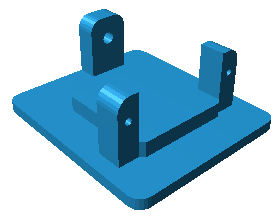|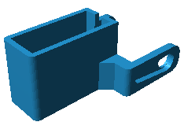|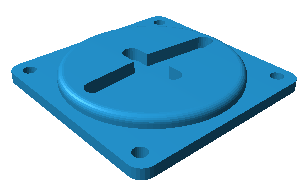|

## Schematic and Connections
I assembled all the components for the prototype over a full size proto-breadboard. This is the schematic
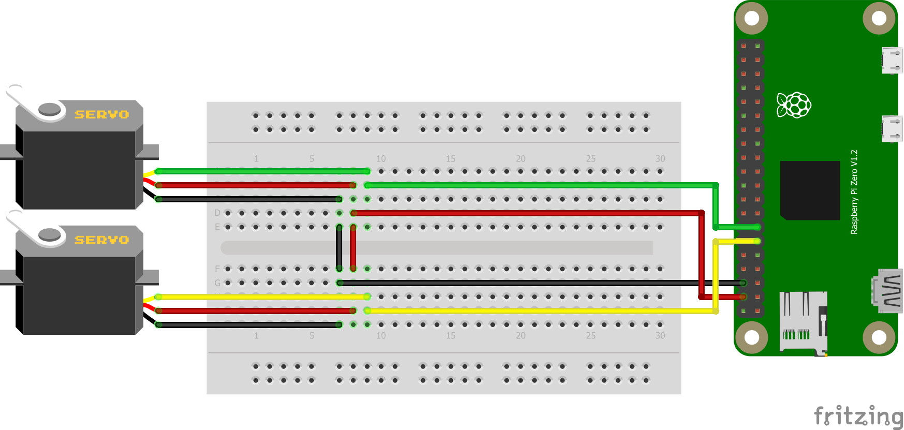

### OS
As you can see, I used a Raspberry Pi Zero + due to its small size. It has excess performance to run the Python script to control the movement of the servos and enough to run a program for calculating satellite orbits. You can install the Raspberry Pi OS Lite. Here you are the [RPI OS installation guide](https://www.raspberrypi.org/documentation/installation/installing-images/)
You don't need anything special to run the tracking program.

## Where is my SAT?
You can find several applications for mobile which allows you to have the most accessible information. But in the Linux environment there are the applications that will give us more precision and quantity of information. A very easy to install and configure is [Gpredict](https://github.com/csete/gpredict). It allows advanced options such as defining control interfaces with ham radios and rotors like this.

### Instalation
To install GPredict. Being a desktop application I have chosen this way of installation:
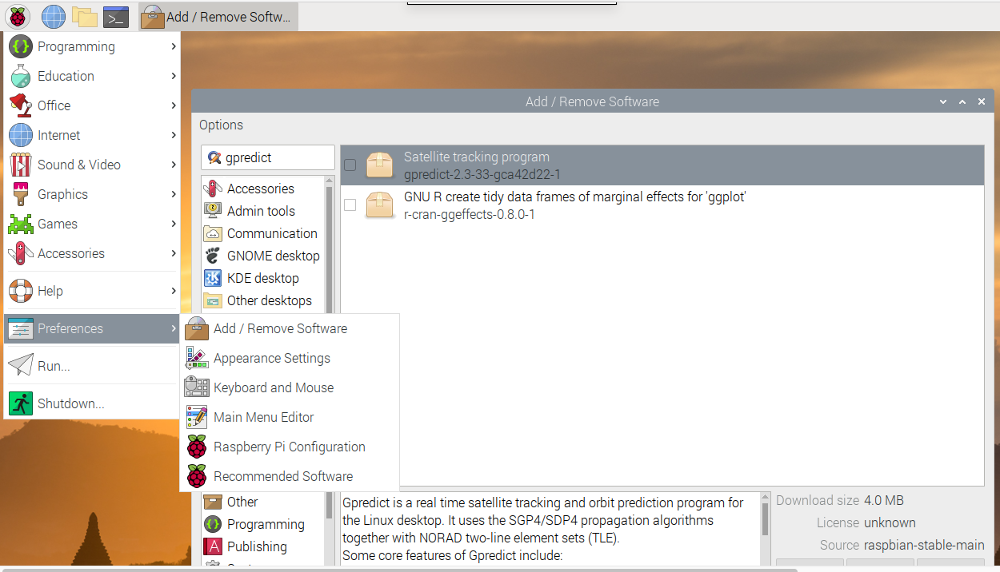

After updating the TLE files and changing some settings. You can have a tracking in real time and very precise. For example the ISS:
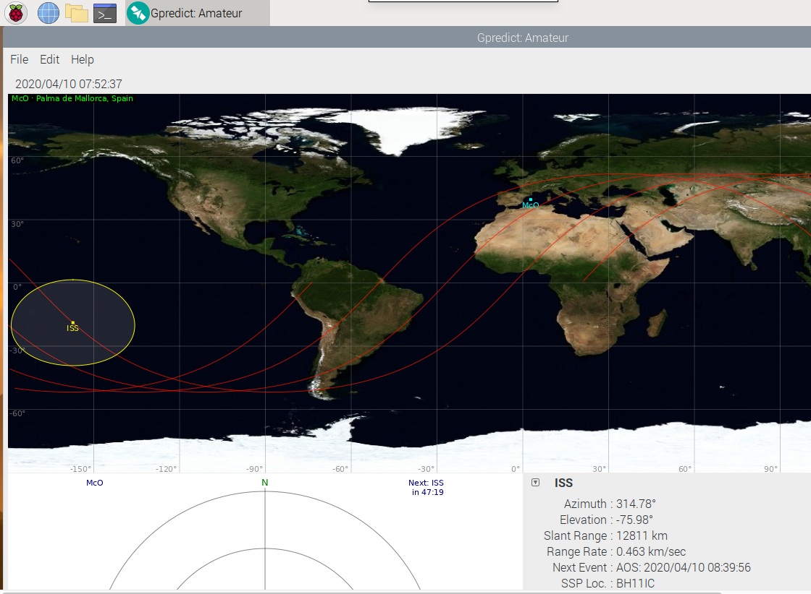

## Elevation calculation
For low elevation passes, the trajectory approaches a parabolic curve. At elevations closer to the zenith, the approximation to a gaussian bell is better.
|Polar view of a low pass base|Azimuth and elevation evolution in a low pass|IDEM in a hight pass|
|---|---|---|
|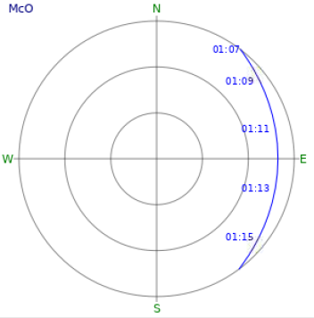|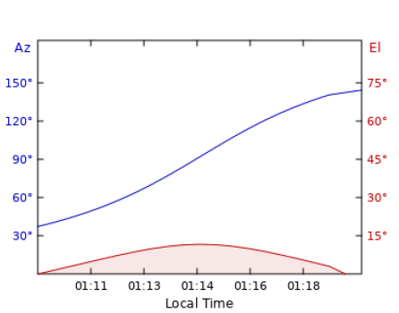|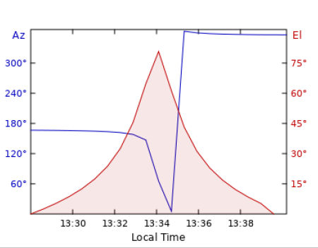|

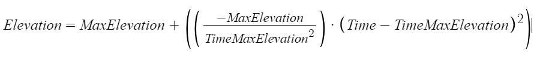

In this first iteration, the **calculation is based on a quadratic equation of a parabolic curve**:
<br>
For the previous case of low pass the equation could be solved like this:
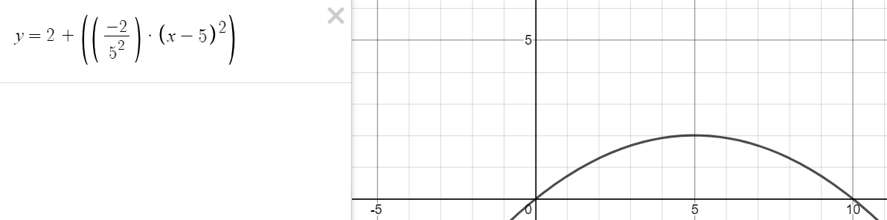
<br>

## The code
I have build only one program developed as a Python script. The code is available in this repository and you can [open here](https://github.com/McOrts/mini-tracker4antenna/blob/main/mini-tracker4antenna.py).

## Run
The program is a Python script that you can execute in command prompt. In the table data with the details of the pass obtained in GPredict. You can find the value for the parameters that you need for call the program.
<br>
These would be the parameters for the low pass of the example :
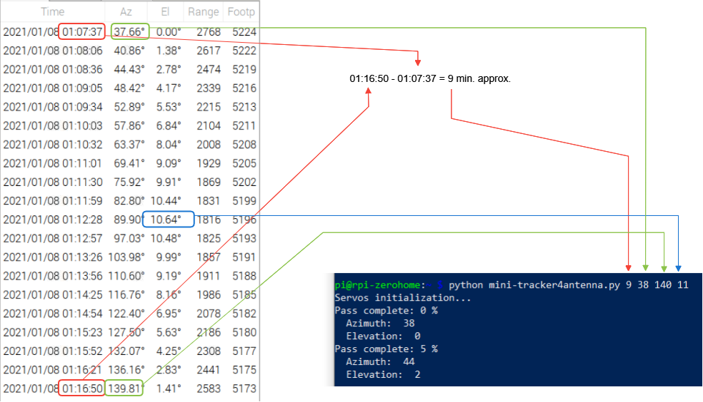
<br>
There is a help with the call formats and the order and meaning of each parameter:
```
Usage:
 python mini-tracker4antenna.py [total pass time in minutes] [Start azimuth degrees] [End azimuth degrees] [Maximum elevation degrees]
 python mini-tracker4antenna.py test
 python mini-tracker4antenna.py ?
e.g: mini-tracker4antenna.py 9 37 140 60
```

## Demo time
[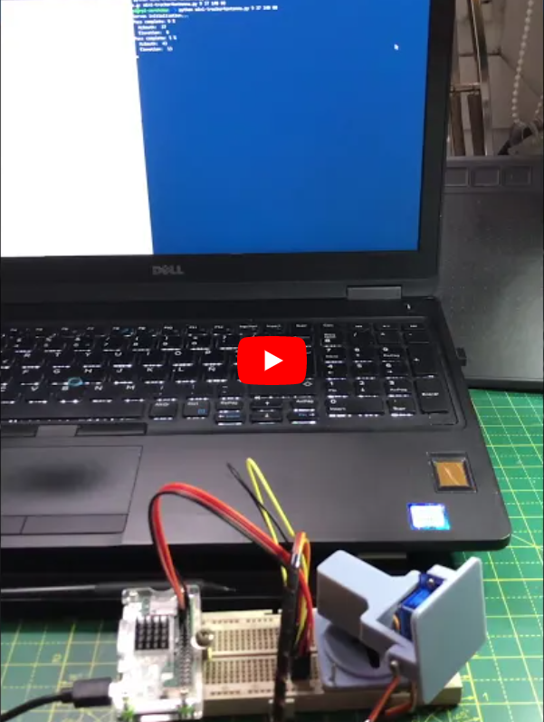](https://youtu.be/1R0TKMD1_78)

## Next steps
* Build a mini-Yagi or Helical antenna handmade.
* Control interface with Gpredict.

## Acknowledgements
**Fernando Bueno** for the 3D design as [fbuenonet in thingverse](https://www.thingiverse.com/fbuenonet/designs) 
